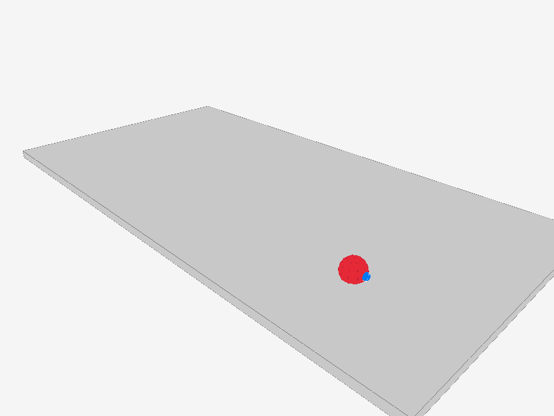

# FRCWorld
A tool for visualizing an FRC robot's pose in real time.

This is an experimental project of mine, and the first "real" 3D application I have built (aside from raytracing).

## Building 

This project uses the [Bazel buildsystem](https://bazel.build). To build and run the application, run the following:

```sh
# Build the binary
bazel build //frcworld

# Run with default settings
./bazel-bin/frcworld/frcworld -i 10.TE.AM.2 -c ./examples/config.json
```

Replace `TE` and `AM` with your team number, and feel free to edit the config JSON file with your robot's measurements.

## Sending data from a robot

This program requires the attached robot to be publishing the following NetworkTables entries as type `double`.

```sh
/drivetrain_x       # X position in meters
/drivetrain_y       # Y position in meters
/drivetrain_theta   # Heading in degrees
```

## Screenshots

\

*The example field and "robot"*